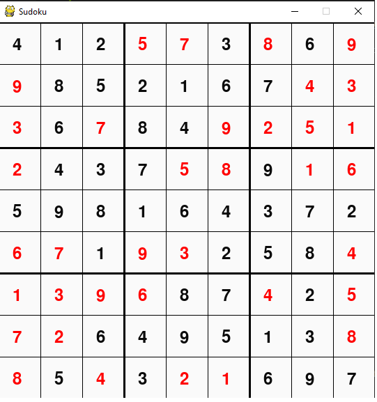

# Sudoku Solver/Generator With PyGame Interface
This Sudoku solver uses backtracking to to complete the puzzle. Puzzles are generatorated by filling in random number 1-9 on the diagonal than solving. If the puzzle is solvable than numbers can be removed to create a puzzle of varying difficulty's. The application is reasonably fast solving and generating a puzzle in usually a fraction of a second.

